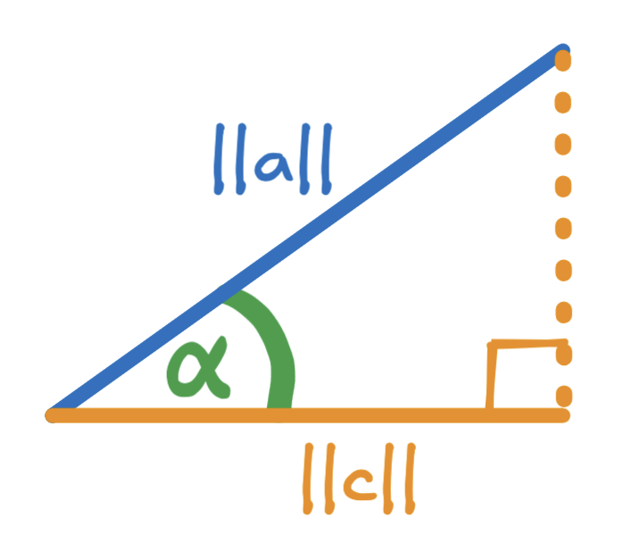

# Similarity Search

Similarity search is the process of finding items in a dataset that are most similar to a given query item.

It is widely used in:

- Recommendation systems
- Image retrieval
- Natural Language Processing (NLP)
- Face recognition systems

---

# 🔍 What is Cosine of an Angle?

The cosine of an angle is defined as:

$$\cos(\alpha)=\frac{\text{Adjacent}}{\text{Hypotenuse}}$$

# ➡️ What is a Vector?

A vector is a mathematical object that has:

- Magnitude (length)
- Direction

Example:

$$a = [4,8]$$

Vectors are represented on a Cartesian plane.

## Vector Representation

---

# 📏 Magnitude of a Vector

The magnitude of a vector is calculated using the L2 norm:

$$\|a\| = \sqrt{\sum_{k=1}^{n} a_k^2}$$

For a 2D vector:

$$\|a\| = \sqrt{x^2 + y^2}$$

Example:

$$a=[4,8]$$

$$\|a\| = \sqrt{4^2 + 8^2}$$

$$\|a\| \approx 8.94$$

---

# Multiple Vectors

Example vectors:

$$a=[4,8]$$

$$b=[11.5,5]$$

## Multiple Vector Visualization

---

# 1️⃣ L2 Distance (Euclidean Distance)

## Definition

L2 distance measures the straight-line distance between two vectors.

$$L2(a,b)=\sqrt{\sum_{i=1}^{n}(a_i-b_i)^2}$$

---

## Example

$$a=[4,8]$$

$$b=[11.5,5]$$

$$L2(a,b)=\sqrt{(4-11.5)^2+(8-5)^2}$$

$$L2(a,b)\approx 8.08$$

---

## Euclidean Distance Diagram

---

# 2️⃣ Dot Product Similarity

## Definition

The dot product of two vectors is:

$$a \cdot b = \sum_{i=1}^{n} a_i b_i$$

---

## Example

$$a=[4,8]$$

$$b=[11.5,5]$$

$$a \cdot b = 4 \times 11.5 + 8 \times 5$$

$$a \cdot b = 86$$

---

# Dot Product Using Angle

$$a \cdot b = \|a\|\|b\|\cos(\alpha)$$

---

## Dot Product Projection Visualization

It turns out that we can calculate the dot product $a \cdot b$ by multiplying the length of vector $b$ ($\|b\|$) by the length of the projection of $a$ onto $b$ ($\|c\|$):

$$a \cdot b = \|b\| \ \|c\|$$

Now, let $\alpha$ represent the angle between vectors $a$ and $b$ as shown in the above diagram. Note that the projection of $a$ onto $b$ forms a right-angle triangle with length $\|c\|$ forming an adjacent side for angle $\alpha$ and the length $\|a\|$ forming the hypotenuse. This allows us to use the following equation for the cosine of an angle:

$$\cos(\alpha) = \frac{\text{adjacent}}{\text{hypotenuse}}$$

$$\cos(\alpha) = \frac{\|c\|}{\|a\|}$$

Rearranging the above, we can solve for $\|c\|$:

$$\|c\| = \|a\| \cos(\alpha)$$

Finally, replacing $\|c\|$ with $\|a\| \cos(\alpha)$ in the calculation of the dot product:

$$a \cdot b = \|b\| \ \|c\|$$

$$a \cdot b = \|b\| \ \|a\| \cos(\alpha)$$

$$a \cdot b = \|a\| \ \|b\| \cos(\alpha)$$

In the above image, the length of the projection of $a$ onto $b$ is depicted as $\|a\|\cos(\alpha)$, and the length of vector $b$ is indicated as $\|b\|$. The dot product $a \cdot b$ is just the product of the lengths $\|b\|$ and $\|a\| \cos(\alpha)$, or, when rearranged, $\|a\| \ \|b\| \cos(\alpha)$.

---

# 3️⃣ Cosine Similarity

## Definition

Cosine similarity measures the cosine of the angle between two vectors.

$$\text{cosine similarity}(a,b)=\frac{a \cdot b}{\|a\|\|b\|}$$

---

## Cosine Similarity Diagram

---

# Cosine Distance

$$\text{cosine distance}(a,b)=1-\text{cosine similarity}(a,b)$$

---

# 🔄 Vector Normalization

To normalize a vector:

$$\text{norm}(a)=\frac{a}{\|a\|}$$

Example:

$$a=[4,8]$$

Normalized vector:

$$\text{norm}(a)\approx[0.448,0.895]$$

---

# 🧠 Choosing the Right Metric

| Metric | Sensitive to Magnitude | Best For |
|---|---|---|
| L2 Distance | ✅ Yes | Spatial data |
| Cosine Similarity | ❌ No | NLP, embeddings |
| Dot Product | ✅ Yes | Recommendations |

---

# 🧪 Practical Considerations

## L2 Distance
- Good for geometric data
- Sensitive to magnitude

## Cosine Similarity
- Excellent for text embeddings
- Works well in high-dimensional data

## Dot Product
- Computationally efficient
- Used heavily in neural networks

---

# ✅ Conclusion

Choosing the correct similarity metric is very important in machine learning and vector databases.

- Use **L2 Distance** when actual distance matters.
- Use **Cosine Similarity** for semantic similarity.
- Use **Dot Product** when both magnitude and direction matter.

---

# Author

**Wojciech "Victor" Fulmyk**