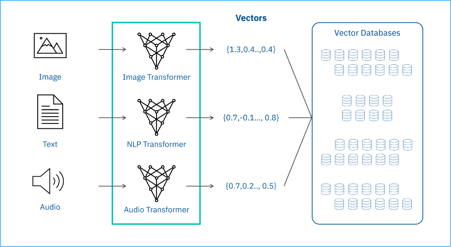
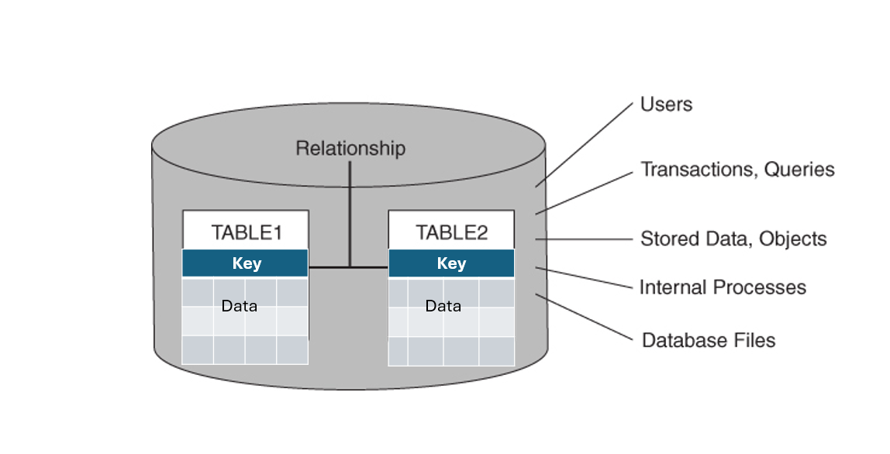

# Vector Databases vs Relational Databases

# What is a Vector Database?

A **Vector Database** is a special type of database that stores data in the form of **vectors (numerical embeddings)** instead of rows and columns.

It is mainly used in:
- Artificial Intelligence (AI)
- Machine Learning (ML)
- Recommendation systems
- Semantic search applications

The main purpose of a vector database is to find **similar data quickly**.

### Interview Definition

> A vector database stores data as embeddings (vectors) and is mainly used for similarity search and AI-based applications.

---

# Vector Database Data Storage



In vector databases, different types of data such as:
- Images
- Text
- Audio

are converted into vectors using AI models called **transformers**.

These vectors are then stored in the vector database.

Each vector contains numerical values that represent the features of the data.

---

# Real-Life Example of Vector Database

## Example: YouTube Recommendations

When you watch videos on YouTube:
- The system converts videos into vector embeddings.
- It compares your watched videos with other similar vectors.
- Then it recommends similar videos.

This process uses **similarity search** inside a vector database.

---

# Vector Embedding Workflow

```text
Image/Text/Audio
        ↓
Transformer Models
(Image Transformer / NLP Transformer / Audio Transformer)
        ↓
Vector Embeddings
        ↓
Vector Database
```

---

# Example of Embeddings

```text
Image  → {1.3, 0.4, ..., 0.4}
Text   → {0.7, -0.1, ..., 0.8}
Audio  → {0.7, 0.2, ..., 0.5}
```

These numbers represent the important features of the data.

---

# Features of Vector Databases

- Fast similarity search
- Handles unstructured data
- Supports AI and ML applications
- Works efficiently with embeddings
- Scalable for large datasets

---

# Vector Libraries

Vector libraries are used inside vector databases for fast similarity searching.

### Features
- Fast vector search
- Efficient storage
- Pre-built similarity algorithms

---

# Difference Between Vector Libraries and Vector Databases

| Vector Libraries | Vector Databases |
|---|---|
| Mainly used for similarity search | Full database support |
| Limited functionality | CRUD operations supported |
| Mostly in-memory | Persistent storage |
| Search-focused | Enterprise-level deployment |

CRUD = Create, Read, Update, Delete

---

# What is a Relational Database?

A **Relational Database** stores data in the form of:
- Tables
- Rows
- Columns

It uses **SQL (Structured Query Language)** to manage and query data.

Relational databases are best for structured data where relationships are important.

---

# Relational Database Data Storage

Relational databases store data inside tables.

- Each row represents a record.
- Each column represents a property.

Tables are connected using:
- Primary Keys
- Foreign Keys



---

# Real-Life Example of Relational Database

## Example: Banking System

In a banking application:
- Customer details are stored in one table.
- Account details are stored in another table.
- Transactions are stored in another table.

These tables are connected using keys.

Relational databases are good when:
- Data is structured
- Relationships are important
- Transactions must be accurate

---

# Relational Database Structure

```text
TABLE 1 ───── Relationship ───── TABLE 2
   │                                  │
Rows & Columns                  Rows & Columns
```

---

# Common SQL Operations

- SELECT
- INSERT
- UPDATE
- DELETE

These databases also support:
- Transactions
- Queries
- Data consistency

---

# Vector Database vs Relational Database

| Feature | Relational Database | Vector Database |
|---|---|---|
| Data Storage | Tables | Vectors |
| Data Type | Structured Data | Unstructured Data |
| Query Method | SQL Queries | Similarity Search |
| Best For | Business Applications | AI/ML Applications |
| Relationships | Primary & Foreign Keys | Semantic Similarity |
| Examples | MySQL, PostgreSQL | Pinecone, Weaviate, Milvus |

---

# Interview-Friendly Difference

## Relational Database
Used when:
- Data is structured
- Relationships are important
- Transactions are required

### Example
Banking systems, ERP systems, employee management systems.

---

## Vector Database
Used when:
- Working with AI applications
- Searching similar content
- Handling embeddings

### Example
ChatGPT memory search, recommendation systems, image search.

---


## What is a Vector Database?

> A vector database stores data in the form of embeddings or vectors.  
> It is mainly used in AI and machine learning applications for similarity search, recommendation systems, and semantic search.

---


## Difference Between Vector Database and Relational Database

> Relational databases store structured data in tables using SQL, while vector databases store embeddings in vector form for similarity search.  
> Relational databases are used in traditional applications, whereas vector databases are mainly used in AI and machine learning systems.

---

# Quick Interview Summary

| Database Type | Best Use Case |
|---|---|
| Relational Database | Structured business data |
| Vector Database | AI and similarity search |
