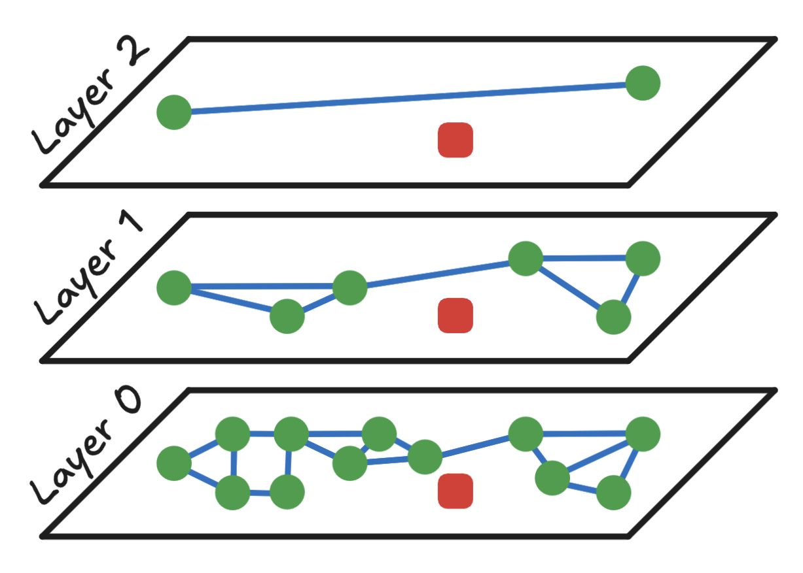
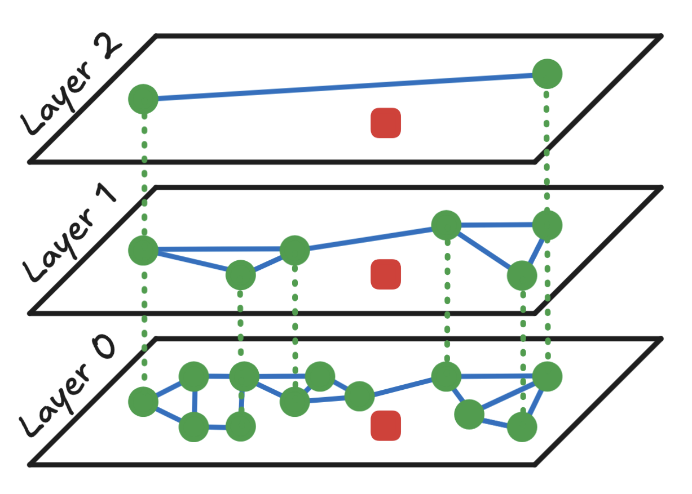
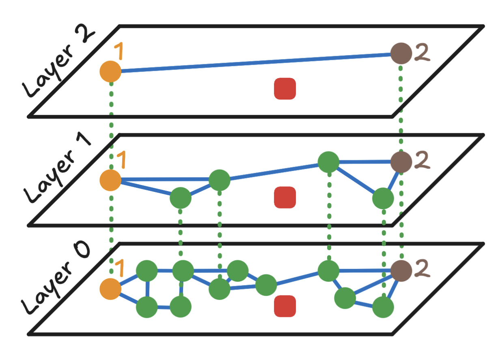
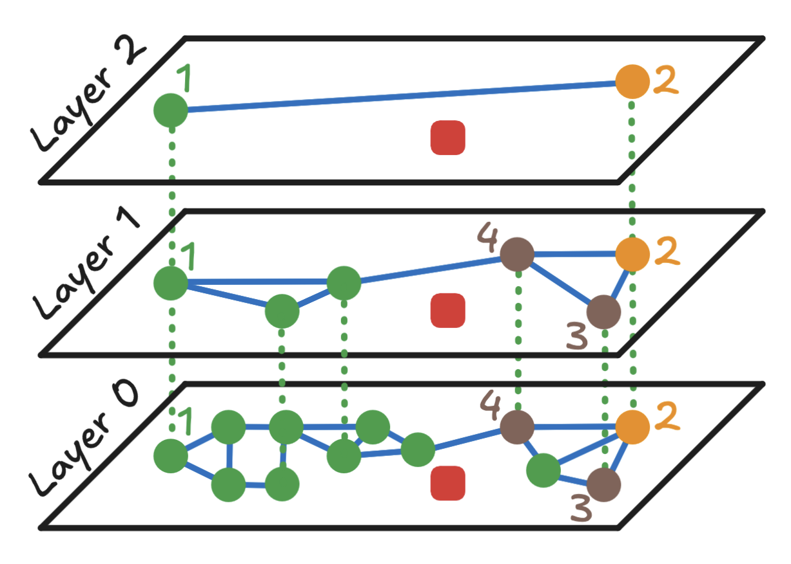
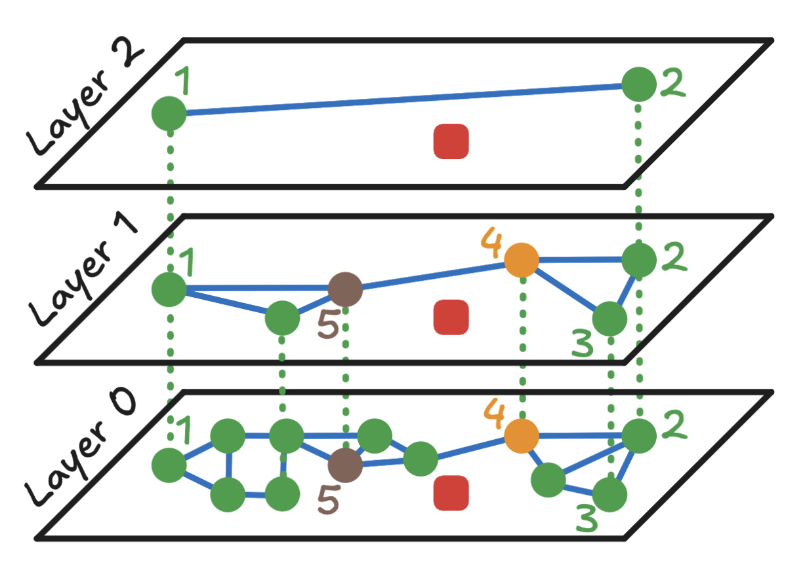
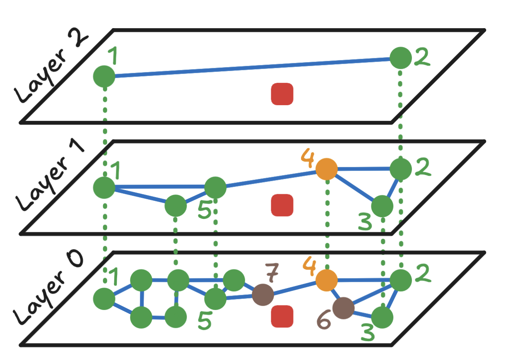

# How HNSW Performs a Search — Step by Step

Before understanding how the HNSW index is built, let's first see how a search is performed.

---

# Step 1: Start with an HNSW Index

The diagram below illustrates a Hierarchical Navigable Small World (HNSW) graph.

The bottom layer (**Layer 0**) contains all data points (green circles), while the upper layers contain progressively fewer points.

The **red square** represents the query vector, and the objective is to find the approximate nearest neighbor.

In this example there are **12 data points**.

A brute-force search would compare the query against all 12 vectors.

Instead, HNSW navigates the graph and performs only a handful of distance computations.

---

Some data points appear in multiple layers.

The dotted vertical lines below show that the same node exists across layers.

Notice that while the nodes are shared between layers, **their connections are different in each layer**.

The upper layers contain fewer nodes with longer-range edges, allowing rapid traversal across the graph.

---

# Step 2: Enter the Graph

The search always starts from the **entry point** in the highest layer.

In this example, the search starts at **Point 1** in **Layer 2**.

---

# Step 3: Perform Greedy Search in the Current Layer

At every layer HNSW performs a greedy search.

For the current node:

1. Compute the distance between the node and the query.
2. Compute the distance between each neighboring node and the query.
3. Move to whichever neighbor is closer.
4. Repeat until no unexplored neighbor is closer.

For Layer 2:

- Start at **Point 1**
- Compare Point 1 and Point 2
- Point 2 is closer to the query
- Move to Point 2

Since Point 2 has no better unexplored neighbors, continue to the next layer.

---

# Step 4: Move Down One Layer

The closest node from the previous layer becomes the **entry point** for the next layer.

Here **Point 2** becomes the entry point in Layer 1.

Now compute distances between:

- Point 2
- Point 3
- Point 4

Point 4 is the closest, so continue searching from Point 4.

---

Point 4 still has unexplored neighbors.

Its new neighbor is Point 5.

Compute:

- Distance(Point 4, Query)
- Distance(Point 5, Query)

Point 4 remains the closest node.

No better unexplored neighbor exists.

Proceed to Layer 0.

---

# Step 5: Final Search in Layer 0

The search now enters the bottom layer using Point 4.

Now compare Point 4 with its neighbors.

From Point 4:

- Point 6
- Point 7

Point 7 is closer.

Move to Point 7.

Next compare Point 7 with its unexplored neighbor.

Only Point 8 remains unexplored.

After checking Point 8, Point 7 is still the closest node.

The search terminates.

---

# Step 6: Return the Approximate Nearest Neighbor

The algorithm returns **Point 7** as the approximate nearest neighbor.

Although HNSW is an **Approximate Nearest Neighbor (ANN)** algorithm and does not always guarantee the exact nearest neighbor, it usually returns a very close result.

### In this example

- Brute-force search required **12** distance calculations.
- HNSW required only **8**.

For millions of vectors, the savings become enormous while maintaining very high accuracy.

---

This completes the search process.

The next section explains **how the HNSW graph itself is constructed**, including:

- Layer assignment
- Greedy insertion
- Neighbor selection
- Graph construction
- Parameters such as **M**, **efConstruction**, and **efSearch**

# How the HNSW Index is Built — Step by Step

Imagine you're building a smart city map where every building (data point) is connected to others in a way that helps you find the fastest route to any destination. That's what HNSW does — but with data.

---

# Step 1: Start with an Empty Graph

At the beginning, there's no structure — just an empty space.

The first data point you insert becomes the starting point (called the **entry point**) for all future insertions and searches.

---

# Step 2: Assign a Height (Layer) to Each Data Point

Each data point can be visualized as a building in a city.

Some buildings are tall (they appear in higher layers), and some are short (they only appear on the ground floor).

The height is chosen randomly, but taller buildings are rarer. This assignment follows an **exponentially decreasing probability distribution**.

* Most points only appear on the ground floor (**Layer 0**).
* A few appear on higher floors (**Layer 1, Layer 2, Layer 3**, and so on).

This layered structure helps the algorithm **zoom in** from a broad overview to fine details.

---

# Step 3: Insert the Point into the Graph

For each new point:

## a. Start at the Top Layer

Begin at the highest layer where the current entry point exists.

Use a method called **greedy search**:

* Look at the neighbors of the current point.
* Move to the one that's closest to the new point.
* Repeat this until you can't get any closer in that layer.

---

## b. Move Down One Layer

Once you've reached the best spot in the current layer, go down to the next lower layer.

Repeat the greedy search from the best point found in the previous layer.

---

## c. Connect to Neighbors

At each layer (from the top down to the ground floor), the new point connects to its **M closest neighbors**.

These connections are **bidirectional**—both points know about each other.

This creates a **small-world network**, enabling fast traversal between data points.

---

# Step 4: Repeat for All Points

Every new point goes through the same process:

1. Assign a random height.
2. Search from the top.
3. Connect to neighbors at each level.

Over time, this builds a **multi-layered graph** that's fast to search through.

---

# Key Parameters that Control the Build and Search Process

## 1. M — Maximum Connections per Node

Controls how many neighbors each point connects to.

* Higher **M** = Better accuracy, more memory usage.
* Lower **M** = Faster build, less memory, lower accuracy.

---

## 2. efConstruction — Search Breadth During Build

Controls how many candidate nodes are considered when finding neighbors during insertion.

* Higher **efConstruction** = Better graph quality, slower build.
* Lower **efConstruction** = Faster build, but possibly lower search quality later.

---

## 3. efSearch — Search Breadth During Querying

Used only when searching the graph.

Controls how many candidate nodes are explored during a query.

* Higher **efSearch** = Better accuracy, slower search.
* Lower **efSearch** = Faster search, but might miss the best matches.

This is the primary parameter for tuning the **speed vs. accuracy** trade-off at query time.

---

## 4. ml — Level Multiplier

Controls how likely a point is to appear in higher layers.

It determines the shape of the hierarchy—whether there are more or fewer "tall buildings."

---

# Why This Works

The top layers help you make **big jumps** across the vector space, similar to highways.

The bottom layer provides **fine-grained navigation**, similar to local streets.

Together, these layers make HNSW both **fast** and **accurate**, even for very large datasets.

---

# Step 1: Start at the Top

When searching, HNSW begins at the highest layer.

There are only a few points here, but they are connected by long-range links.

The algorithm starts from a predetermined **entry point**, usually the most recently inserted node.

---

# Step 2: Navigate Toward Your Target

The algorithm performs **greedy routing**.

At each step, it asks:

> Which of my connected neighbors is closest to the query?

It moves to that neighbor and repeats the process until it cannot find a closer node.

---

# Step 3: Move Down a Layer

Once the algorithm reaches a local minimum in the current layer, it moves down to the next layer.

Lower layers contain:

* More nodes
* More detailed connections

This enables increasingly precise navigation.

---

# Step 4: Repeat Until You Reach the Bottom

The algorithm repeats the following process:

1. Perform greedy search.
2. Move down one layer.
3. Continue until Layer 0 is reached.

Layer 0 contains every data point in the graph.

---

# Step 5: Find the Best Matches

At the bottom layer, HNSW performs one final greedy search.

The algorithm returns one or more **approximate nearest neighbors**, depending on the requested value of **k**.

---

## Time Complexity

The hierarchical structure enables approximately **O(log n)** search complexity, compared to **O(n)** for brute-force search.

---

# The Trade-offs: Understanding the Limitations

## Approximate Results

HNSW delivers fast and highly accurate results, but it does not always guarantee the exact nearest neighbor.

Typical recall ranges from **90% to 99%**, making it an excellent trade-off for most real-world applications.

---

## Parameter Tuning

Getting the best performance requires tuning several parameters.

### Key Parameters

* **M** — Maximum connections per node
* **efConstruction** — Controls graph quality during indexing
* **efSearch** — Controls speed vs. accuracy during querying
* **ml** — Controls layer probability distribution

### General Guidelines

* Start with **M = 16** and **efConstruction = 200**.
* Increase **M** if higher recall is required.
* Increase **efSearch** for better accuracy.
* Benchmark different values to find the best configuration.

---

## Dynamic Updates

HNSW is best suited for mostly static datasets.

Frequent insertions and deletions can:

* Degrade graph quality.
* Require periodic rebuilding.
* Increase synchronization complexity.

---

## Distance Metric Limitations

HNSW performs best with:

* Euclidean Distance (L2)
* Cosine Similarity

Other distance metrics may require modifications or may perform less efficiently.

---

# The Science Behind HNSW

## The Original Research

HNSW was developed by **Yu. A. Malkov** and **D. A. Yashunin** in 2016.

Their paper,

> *Efficient and Robust Approximate Nearest Neighbor Search Using Hierarchical Navigable Small World Graphs*

introduced one of the most influential ANN algorithms used today.

---

## Key Innovation

HNSW combines two foundational ideas:

* **Skip Lists** — A probabilistic data structure introduced by William Pugh (1989).
* **Navigable Small World Networks** — Networks that enable efficient routing using intelligent graph connections.

---

## Mathematical Foundation

Although the mathematics is sophisticated, the main ideas are straightforward.

### Search Complexity

The hierarchical graph enables approximately **O(log n)** search instead of **O(n)**.

### Connection Strategy

Each node connects to its **M nearest neighbors**.

The value of **M** controls both accuracy and memory usage.

### Greedy Search Guarantee

At every layer, the algorithm reaches a local minimum.

The hierarchical structure makes it highly likely that this local minimum is close to the global optimum.

---

# Theoretical Properties

* **Scale Separation** — Higher layers provide long-range "highway" connections.
* **Polylogarithmic Complexity** — Search scales approximately as **O(logᵏ n)**.
* **High Probability Guarantees** — Mathematical analysis shows HNSW is highly likely to find near-optimal neighbors.

---

# Practical Considerations

## When to Use HNSW

HNSW is ideal when you need:

* Fast similarity search over large datasets.
* High accuracy with low latency.
* Efficient search in high-dimensional vector spaces.
* A scalable ANN index.

---

## When Not to Use HNSW

Consider other approaches if:

* Exact nearest neighbors are mandatory.
* The dataset is very small.
* Memory usage is extremely constrained.
* The dataset changes very frequently.

---

# Conclusion

Hierarchical Navigable Small World (HNSW) is one of the most effective algorithms for Approximate Nearest Neighbor (ANN) search.

By organizing vectors into multiple layers and connecting similar vectors through a navigable graph, HNSW enables extremely fast searches while maintaining high accuracy.

Although the underlying mathematics is sophisticated, the core idea is intuitive: use higher layers for long-distance navigation and lower layers for precise local search.

This combination allows HNSW to power modern vector databases and AI applications at massive scale, making similarity search both practical and efficient.
